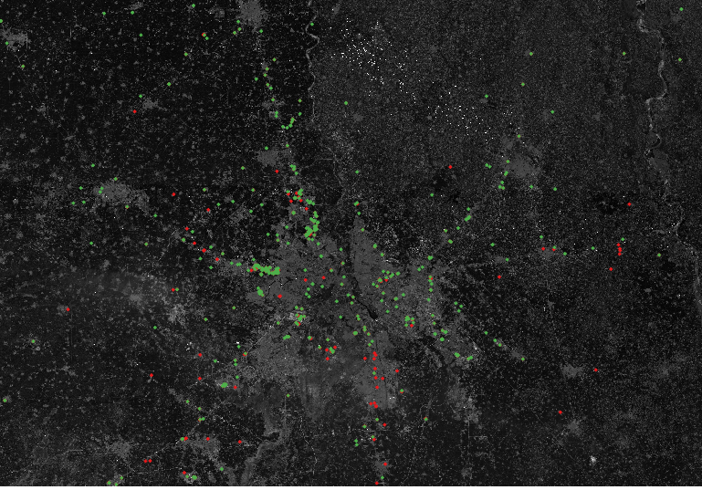

# Impact!

# COVID19 SPACE APPS CHALLENGE

## VEHICLES
This prototype requires Python 3 with [xcube](https://github.com/dcs4cop/xcube/) as well as [xcube_sh](https://github.com/dcs4cop/xcube-sh) plugin. You also need to be registered at [Sentinel Hub](https://www.sentinel-hub.com/) and setup the CLIENT_ID and CLIENT_SECRET to access the dataset using their xcube_sh API.

Before running this code, make sure you have xcube activated using conda.

```
conda activate xcube
```

## DESCRIPTION

This is a prototype for mapping possible vehicle locations using Sentinel 2 L2A dataset and storing their data in a NETCDF dataset. One can use QGIS to import the dataset and further analyse it as required. The images created has two different colors to distinguish vehicles found during March - April of 2019 and 2020.



## MOBILITY STUDY

mobility.py analyzes the impact of COVID 19 on the mobility around 6 different sectors: Retail and Recreation, Grocery and Pharmacy, Parks, Transit Stations, Workplaces, and Residential Areas. This impact was studied for the following states specifically: Delhi, Maharashtra, Karnataka, Andhra Pradesh, and Tamil Nadu. The script plots mobility percent change from baseline from the month of February to the month of May for each of these states to explore how the mobility evolved across these months.

feature_importance.py analyzes the impact of the mobility in different sectors on the number of cases in India. The script gathers the mobility of each of these sectors averaged across the 4 months for every state along with the total number of cases in each of these states. It then calculates mutual information between the mobility of each of these sectors with the number of cases and rank them from highest to lowest to see which correlates the best with the number of cases. A bar graoh with the respective mutual information's is given as output. Mutual Information between two random variables is a measure of their mutual dependence. We found that mobility around transit stations is the best indicator for the number of cases and mobility around groceries and pharmacies the worst.
